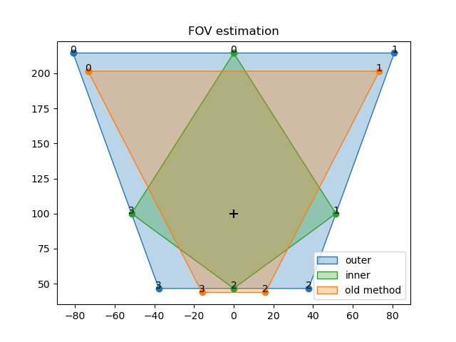

# fov generation and plotting
python code to calculate FOV extremes from a stationary point

```python
p0=np.array([0., 0., -100.])
az_bw_deg=[  0., 40.]
el_bw_deg=[-45., 40.]
(outer,inner,centre) = create_fov(p0, az_bw_deg=az_bw_deg, el_bw_deg=el_bw_deg)
(old_,_) = old_fov(p0, az_bw_deg=az_bw_deg, el_bw_deg=el_bw_deg)

fig, ax = plt.subplots()
plot_fov(outer, name='outer', colour = 'tab:blue', ax=ax)
plot_fov(inner, name='inner', colour = 'tab:green', ax=ax)
plot_fov(old_, name='old method', colour = 'tab:orange', ax=ax)
ax.scatter(centre[1], centre[0], color='k', s=80, marker='+')
plt.title('FOV estimation')

plt.legend(loc="lower right")
#plt.savefig("FOV_plot.png")
plt.show()
```


